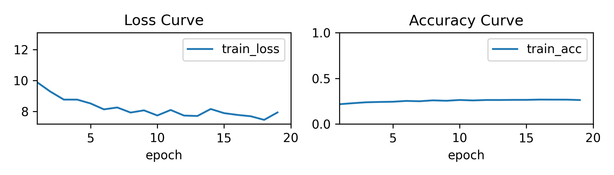
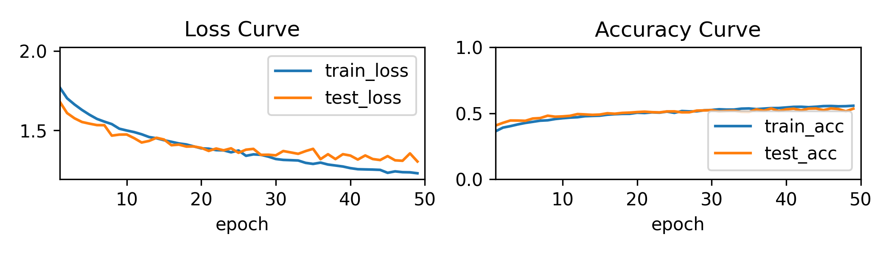
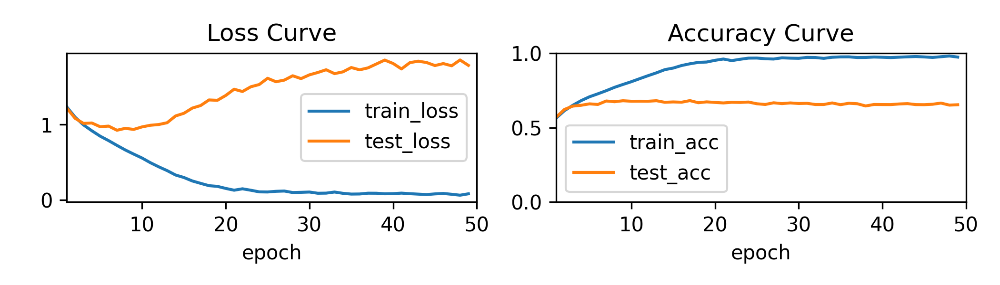
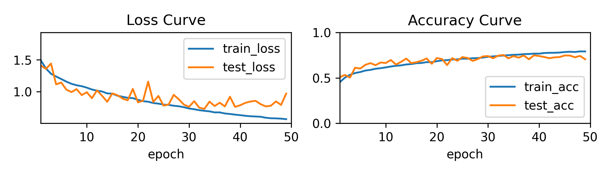
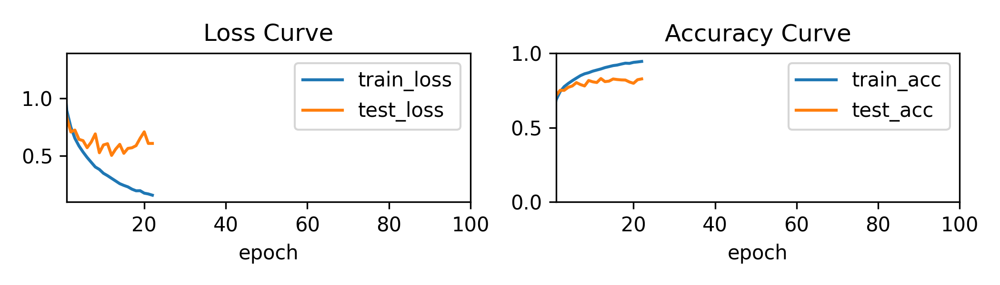

### 项目结构

```
CIFAR-10-Training
├── CIFAR-10.ipynb
├── CIFAR-10.py
├── README.md
├── cifar-10-batches-py
│   ├── batches.meta
│   ├── data_batch_1
│   ├── data_batch_2
│   ├── data_batch_3
│   ├── data_batch_4
│   ├── data_batch_5
│   ├── readme.html
│   └── test_batch
└── output
    ├── cnn.pth
    ├── cnn1.pth
    ├── cnn1_fig.png
    ├── cnn1_training_metrics.csv
    ├── cnn2.pth
    ├── cnn2_fig.png
    ├── cnn2_training_metrics.csv
    ├── cnn3.pth
    ├── cnn3_fig.png
    ├── cnn3_training_metrics.csv
    ├── cnn_fig.png
    ├── cnn_training_metrics.csv
    ├── mlp_final.pth
    ├── mlp_final_fig.png
    ├── mlp_final_training_metrics.csv
    ├── mlp_first.pth
    ├── mlp_first_fig.png
    ├── mlp_first_training_metrics.csv
    └── sfm_fig.png
```

[See Also](https://blog.leosrealms.top/blog/2025-11-21-cifar-10-training/)

### 开发过程

#### 从零学习基础知识 + 用时

1 day on PyTorch API - 详见[笔记](https://blog.leosrealms.top/blog/2025-11-14-pytorch-library-api-summary/)  
5 days on Deep Learning Basic Theory and Code Implementation

- [线性回归笔记](https://blog.leosrealms.top/blog/2025-11-11-linear-regression-model/)
- [感知机笔记](https://blog.leosrealms.top/blog/2025-11-16-perceptron/)
- 模型容量、过拟合和欠拟合笔记
- [数值稳定性笔记](https://blog.leosrealms.top/blog/2025-11-18-numerical-stability---initialization-and-activation-functions/)
- 更多本地笔记没有发布

1 day on Pandas 数据处理  
1.5 days on D2L California House Price Prediction Contest  
2.5 days on CIFAR-10

#### CIFAR-10 训练

##### 上手前步骤规划

1. 先使用 softmax 回归做一个“可行验证”，主要调输入输出和可视化 API，顺便完成可迁移架构的编写
2. 跑通之后，切换到简单的 MLP，在 `data_batch_1` 和 `test_batch` 上做 hyper parameter 的 tuning
3. 将 MLP 在全部 5 个 batch 上训练，并记录下来每个 epoch 的 loss 和 acc，使用 Matplotlib 实时可视化，最后将这些 metrics 和得到的网络一起保存
4. 切换到 CNN 进行新一轮调参训练

这里提一下，之所以 4. 直接上了 5 个 batch 进行调参，而没有只使用 `data_batch_1`，是因为后来活佛舍友答应借我 RTX 5070 Ti 一用了~~啊哈哈哈~~***==感激不尽==***。

##### 详细记录

==代码经过重构，原始代码已经被一次次覆写掉了。代码可读性应该不错，只不过 debug 的痕迹被抹去了。==

**所有的训练记录（图像和 metrics）+ 模型权重均放置在 `/output/` 里面**

框架内容详见 `CIFAR-10.py`，之后将只呈现网络部分。

1. softmax 回归试水



嗯嗯，能跑通

2.  MLP 启动！  
   非常可惜，由于调参过程过于痛苦以及我很暴躁，全程很少有中间模型和参数留存下来，因此过程性记录这一块有些欠缺。  
   这里只能浅浅附一个一开始写的模型和最终的版本来看看
   
   初代，几乎没有正则，优化器 SGD，lr=0.1，wd=0
	      
```py title=mlp-first
mlp_first_net = init_net(nn.Sequential(
    nn.Flatten(),                             
    nn.Linear(in_size, 3*32), nn.ReLU(), nn.Dropout(0),
    nn.Linear(3*32, out_size)
))

mlp_first_trainer = Trainer(mlp_first_net)

mlp_first_trainer.train(X01, y01, X_test, y_test)
```

   50 epochs：


   最终测试集 acc 在 45% 左右，后段疑似出现过拟合。
>然而，后来发现其实是我忘记在全部 5 个 data_batch 上训练了，只训了第一个，导致在测试集上表现不佳（有 bias）。然而当时我一心以为是过拟合

  然而我还是犹豫收敛不够快而疯狂加学习率，到了 5 甚至 10。开始出现 loss nan 的问题。后来（调了很久），决定另起一个网络，不在原来的基础上调了。这次加深网络，加大 num_epoch，减小学习率。然后…过拟合严重。
  
  来到终代，加深到了四层，同时加上正则 `weight_decay` 和 `Dropout`，优化器上 Adam，lr=0.001
 
```py title=mlp_final
mlp_final_net = init_net(nn.Sequential(
	nn.Flatten(),
	nn.Linear(in_size, 1024), nn.ReLU(), nn.Dropout(0.2),
	nn.Linear(1024, 512), nn.ReLU(), nn.Dropout(0.2),
	nn.Linear(512, 256), nn.ReLU(),
	nn.Linear(256, out_size)
))

mlp_final_trainer = Trainer(
    mlp_final_net,
    learning_rate=1e-3,
    num_epochs=50,
    Optim = torch.optim.Adam,
    weight_decay=1e-4
)

mlp_final_trainer.train(X, y, X_test, y_test)
```

   效果：
   
   
   在 20 个 epoch 之后接近收敛，对于训练集和测试集的准确率都在 50% 左右。
   
3. CNN  
   标准套模板的 CNN 框架  
   **初试 CNN**
```py title=cnn1
cnn1_net = init_net(nn.Sequential(
    nn.Conv2d(3, 64, kernel_size=3, padding=1),
    nn.ReLU(),
    nn.Conv2d(64, 32, kernel_size=3, padding=1),
    nn.ReLU(),
    nn.MaxPool2d(2),

    nn.Flatten(),
    nn.Linear(32*16*16, 256),
    nn.ReLU(),
    nn.Linear(256, out_size)
))

cnn1_trainer = Trainer(
    cnn1_net,
    learning_rate=1e-3,
    num_epochs=50,
    Optim=torch.optim.Adam,
    weight_decay=5e-4
)

cnn1_trainer.train(X, y, X_test, y_test)
```

图：


此时的我：`地铁老人手机.jpg`  
经典的过拟合，标准的不合格  
最终这个双卷积层加池化的 CNN，在训练集上准确率能飙到 97%，在测试集上很拉跨，才 65%

那咋办？先思考一下：过拟合无非就是（按照李宏毅老师的阐释）模型的弹性太高，减小弹性要么加正则，要么减小模型容量。现在这个权重显然太多了，整小点。

继续调参，上池化缩小模型，再上个 Dropout 。。。

**再试 CNN**

```py title=cnn2
cnn2_net = init_net(nn.Sequential(
    nn.Conv2d(3, 32, kernel_size=3, padding=1),  # (3,32,32) to (32,32,32)
    nn.BatchNorm2d(32),
    nn.ReLU(),
    nn.MaxPool2d(2),                             # to (32,16,16)

    nn.Conv2d(32, 64, kernel_size=3, padding=1), # to (64,16,16)
    nn.BatchNorm2d(64),
    nn.ReLU(),
    nn.MaxPool2d(2),                             # to (64,8,8)

    nn.Flatten(),                                # to (4096)
    nn.Linear(64*8*8, 256),
    nn.ReLU(),
    nn.Dropout(0.5),
    nn.Linear(256, out_size)
))

cnn2_trainer = Trainer(
    cnn2_net,
    learning_rate=1e-3,
    num_epochs=50,
    Optim=torch.optim.Adam,
    weight_decay=5e-4
)

cnn2_trainer.train(X, y, X_test, y_test)
```



使用 BatchNorm + Max Pooling + 最后一层线性层 Dropout + weight_decay，过拟合问题缓解，但是似乎有些欠拟合，模型到不了更高的精度了，最终准确率为 77% 左右。

**三试 CNN**
>呵，长大了

```py title=cnn3
cnn3_net = nn.Sequential(
    nn.Conv2d(3, 32, 3, padding=1),
    nn.BatchNorm2d(32),
    nn.ReLU(),
    nn.Conv2d(32, 32, 3, padding=1),
    nn.BatchNorm2d(32),
    nn.ReLU(),
    nn.MaxPool2d(2),    # (32,16,16)

    nn.Conv2d(32, 64, 3, padding=1),
    nn.BatchNorm2d(64),
    nn.ReLU(),
    nn.Conv2d(64, 64, 3, padding=1),
    nn.BatchNorm2d(64),
    nn.ReLU(),
    nn.MaxPool2d(2),    # (64,8,8)

    nn.Conv2d(64, 128, 3, padding=1),
    nn.BatchNorm2d(128),
    nn.ReLU(),
    nn.MaxPool2d(2),    # (128,4,4)

    nn.Flatten(),
    nn.Linear(128*4*4, 256),
    nn.ReLU(),
    nn.Dropout(0.5),
    nn.Linear(256, out_size)
)

cnn3_trainer = Trainer(
    cnn3_net,
    learning_rate=3e-3,
    num_epochs=100,
    Optim=torch.optim.Adam,
    weight_decay=1e-4,
    patience=10
)

cnn3_trainer.train(X, y, X_test, y_test)
```



测试集 acc 收敛，训练提前终止了。测试集最终准确率为 82%，后面也出现了过拟合。

4. 咨询了 ChatGPT，想试试更多模型架构比如 ResNet 什么的，但是没时间了。。。